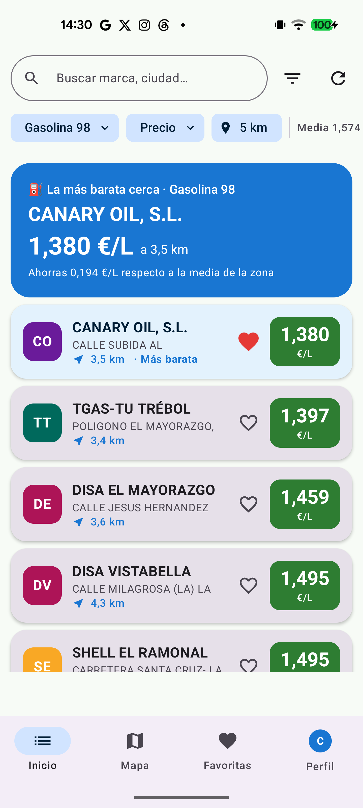
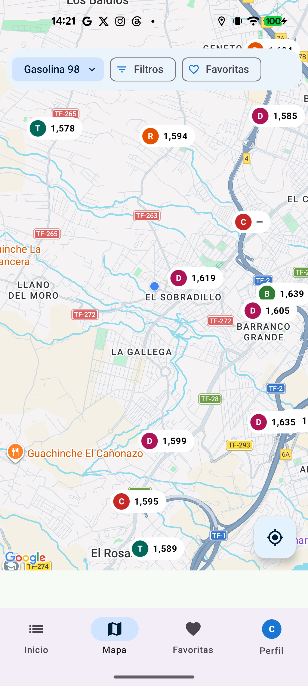
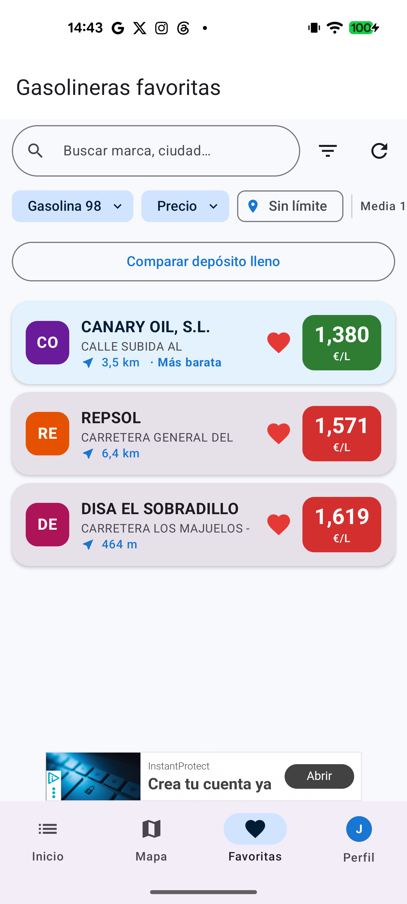

<div align="center">


# GasApp

### La gasolina más barata cerca de ti ⛽

Aplicación Android para encontrar las gasolineras **más baratas de España en tiempo real**, comparar precios, navegar hasta ellas y controlar tu gasto de combustible.

[](#)
[](#)
[](#)
[](#)
[](#)
[](#)

<br/>


&nbsp;

&nbsp;


</div>

---

## 📑 Índice

- [Sobre el proyecto](#-sobre-el-proyecto)
- [Funcionalidades](#-funcionalidades)
- [Arquitectura y stack](#️-arquitectura-y-stack)
- [Estructura del repositorio](#-estructura-del-repositorio)
- [Empezar](#-empezar)
- [Compilar para producción](#-compilar-para-producción)
- [Recursos de marketing](#-recursos-de-marketing)
- [Privacidad](#-privacidad)
- [Roadmap](#️-roadmap)
- [Autor y licencia](#-autor-y-licencia)

---

## 🧭 Sobre el proyecto

GasApp consume la **API oficial y gratuita del Gobierno de España** (MITECO), que publica
todas las estaciones de servicio del país con varias actualizaciones al día. La app las
muestra de forma rápida y clara para que **ahorres en cada repostaje** sin complicarte.

- 🟢 **Gratis** y sin registro obligatorio
- 🗺️ Cobertura de **toda España** (península, Baleares y Canarias)
- ⛽ **8 carburantes + AdBlue**: Gasolina 95/98, Diésel, Diésel Premium, GLP, GNC, GNL, Hidrógeno
- ⚡ Diseño moderno en **Jetpack Compose** y arquitectura limpia

---

## ✨ Funcionalidades

<table>
<tr>
<td width="33%" valign="top">

**🔎 Buscar y explorar**
- Dashboard con la más barata cerca
- Lista por precio / distancia / valor
- Buscador insensible a acentos
- Mapa con clústeres y carteles de precio
- Heatmap por media de zona
- Filtros: combustible, distancia, marca, abiertas, favoritas, precio máx.

</td>
<td width="33%" valign="top">

**👤 Cuenta y sync**
- Login email y **Google** (Credential Manager)
- Favoritas y combustible por defecto en **Firestore**
- Multi-vehículo (combustible y consumo por coche)
- Onboarding interactivo
- Tema claro/oscuro

</td>
<td width="33%" valign="top">

**💰 Ahorro e inteligencia**
- Dinero ahorrado vs. media
- Alertas de bajada de precio
- Historial de precios por estación
- Modo ahorro (ahorro neto por desvío)
- Estadísticas, consumo (L/100 km) y CSV
- OCR de ticket (ML Kit) · Modo coche · Widget

</td>
</tr>
</table>

---

## 🏗️ Arquitectura y stack

**MVVM + Jetpack Compose**, con separación por capas y carga del mapa **por región** (consulta
con _bounding-box_ + límite) para un rendimiento estable.

| Capa | Tecnologías |
|------|-------------|
| **UI** | Jetpack Compose · Material 3 · Navigation Compose · StateFlow |
| **DI** | Hilt |
| **Datos** | Retrofit + kotlinx.serialization · Room (migraciones v1→v5) · DataStore |
| **Mapas/Ubicación** | Maps Compose (clustering, Street View) · FusedLocation · Geocoder |
| **Backend** | Firebase Auth + Firestore |
| **Background** | WorkManager · Glance (widget) · FCM |
| **Otros** | ML Kit Text Recognition · AdMob · Play Billing |

<sub>AGP 8.7.3 · Kotlin 2.0.21 · Compose BOM 2024.12.01 · Firebase BoM 33.7.0 · minSdk 24 · targetSdk 35</sub>

---

## 📂 Estructura del repositorio

```
GasApp/
├── app/                  # Aplicación Android
│   └── src/main/java/com/bpo/gasapp/
│       ├── domain/       # Modelos, repos (interfaces), utilidades
│       ├── data/         # API, Room, Firestore, DataStore, ubicación, mapeos
│       ├── ui/           # Pantallas Compose + ViewModels + navegación
│       ├── di/           # Módulos Hilt
│       ├── work/         # WorkManager (refresco en segundo plano)
│       └── widget/       # Widget Glance
├── landing/              # Landing page estática (HTML/CSS/JS) — lista para IONOS
├── play-assets/          # Icono, feature graphic y capturas para Google Play
├── instagram/            # Imágenes promocionales para redes
├── tools/                # Scripts de generación de assets (Python/Pillow)
├── firestore.rules       # Reglas de seguridad de Firestore
└── PRIVACY_POLICY.md      # Política de privacidad
```

---

## 🚀 Empezar

### Requisitos
- Android Studio (Ladybug o superior) · JDK 17
- Un proyecto de Firebase (Auth + Firestore)

### 1. Clonar
```bash
git clone https://github.com/DanielChineaDev/GasApp.git
```

### 2. `local.properties` (no se versiona)
```properties
MAPS_API_KEY=tu_clave_de_google_maps
WEB_CLIENT_ID=xxxxx.apps.googleusercontent.com
ADMOB_APP_ID=ca-app-pub-xxxxxxxx~yyyyyyyy        # opcional
ADMOB_BANNER_UNIT=ca-app-pub-xxxxxxxx/zzzzzzzz   # opcional
```
- **MAPS_API_KEY** → Google Cloud Console (*Maps SDK for Android* + *Street View Static API*)
- **WEB_CLIENT_ID** → Firebase → Authentication → cliente web OAuth

### 3. `app/google-services.json`
Descárgalo de Firebase Console (app Android `com.bpo.gasapp`). Habilita **Authentication**
(Email + Google) y **Firestore**, y registra tu huella **SHA‑1**.

> ℹ️ Con *Play App Signing*, recuerda añadir también el **SHA‑1 del certificado de firma de Play**
> en Firebase, o el inicio de sesión con Google fallará en las builds distribuidas por Google Play.

### 4. Compilar
```bash
./gradlew :app:assembleDebug
```

---

## 🏭 Compilar para producción

```bash
# 1) Crear keystore (una vez)
keytool -genkey -v -keystore release.keystore -alias gasapp \
  -keyalg RSA -keysize 2048 -validity 10000

# 2) keystore.properties (no se versiona)
#    storeFile=release.keystore
#    storePassword=...
#    keyAlias=gasapp
#    keyPassword=...

# 3) Generar artefactos (R8 + shrink de recursos)
./gradlew :app:assembleRelease   # APK
./gradlew :app:bundleRelease     # AAB para Google Play
```

> La base de datos exporta su esquema en `app/schemas/` y usa **migraciones reales**,
> conservando los datos del usuario al subir de versión.

---

## 🎨 Recursos de marketing

| Carpeta | Contenido |
|---------|-----------|
| [`landing/`](landing) | Landing page estática (hero, funciones, FAQ, privacidad) lista para subir a IONOS |
| [`play-assets/`](play-assets) | Icono 512, *feature graphic* 1024×500, capturas de móvil y tablet, infografía |
| [`instagram/`](instagram) | Posts cuadrados, verticales y stories |
| [`tools/`](tools) | Scripts Python que regeneran todos los assets a partir del logo y capturas |

<div align="center">

</div>

---

## 🔒 Privacidad

GasApp pide lo mínimo imprescindible: la **ubicación** se usa en el dispositivo para mostrar
gasolineras cercanas (sin rastreo en segundo plano) y la **cuenta es opcional**, solo para
sincronizar favoritas. **No se venden datos.** Política completa en
[`PRIVACY_POLICY.md`](PRIVACY_POLICY.md) y en `landing/privacy.html`.

---

## 🗺️ Roadmap

- [x] v1.0 — Mapa, lista, favoritas, alertas, estadísticas, multi-vehículo
- [x] GLP, GNC, GNL, Hidrógeno y AdBlue (datos oficiales)
- [ ] v1.1 — Reseñas de gasolineras con moderación (UGC compliance)
- [ ] v1.2 — Puntos de carga eléctricos (Open Charge Map)

---

## 👤 Autor y licencia

Desarrollado por **Jose Daniel Chinea**.

¿Te resulta útil? Puedes invitarme a un café en **[Ko‑fi](https://ko-fi.com/josedanielchinea)** ☕

© 2026 GasApp · Todos los derechos reservados. Este código se publica con fines de portfolio;
no se concede licencia de uso comercial sin permiso del autor.
